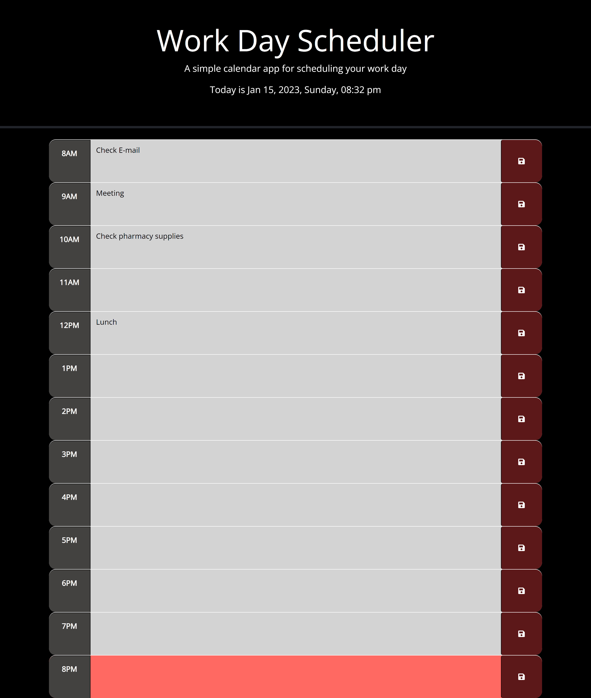

# Nux Cotidie XVIII

## Description

The provided URL above links to a Work Day Scheduler usable for a 12-hour shift. 

It shall contain the following features:

<ul>
<li>The current date, day of the week, and time shall show at the top of the page.</li>
<li>An hourly text area that ranges from 8AM to 8PM</li>
<li>The user may add content to the text area and save them without being erased when refreshing or closing the page, only when the Save Button is initiated, or localStorage is cleared</li>
<li>The time blocks shall indicate if the time is in the past(Gray), present(Red), and future(Green)</li>
</ul>

## Installation

N/A

## Usage

The following features may be used in the page by the user, which fulfills their scheduling needs by:

<ul>
<li>The user is able to use the Work Day Scheduler by adding any type of character within the text area and by saving it when clicking the save button in each box. The content shall be set and retrived via the localStorage as to retain the content even by refreshing & closing the page.  </li>
<li>An hourly background color indicator for past, present, and future objectives.</li>
<li>The scheduler may be reused again by deleting the previous content, rewriting the current objectives, and by saving it. Also, it may be cleared by deleting the browser history.</li>
</ul>

## Page Preview

The following page previews has been added to further exhibit the functionality - 

At the beginning of the day:

By the end-of-day:

## Credits

Credits to the following content below that served as a basis for the developer:

Coding Guide - https://www.w3schools.com/

dayjs guide - https://day.js.org/docs/en/display/format

localStorage guide - https://developer.mozilla.org/en-US/docs/Web/API/Window/localStorage

README tutorial - https://coding-boot-camp.github.io/full-stack/github/professional-readme-guide

Additional credits to all individuals, instructors and teaching assistants, that had provided constructive feedback to this page.

## License

N/A